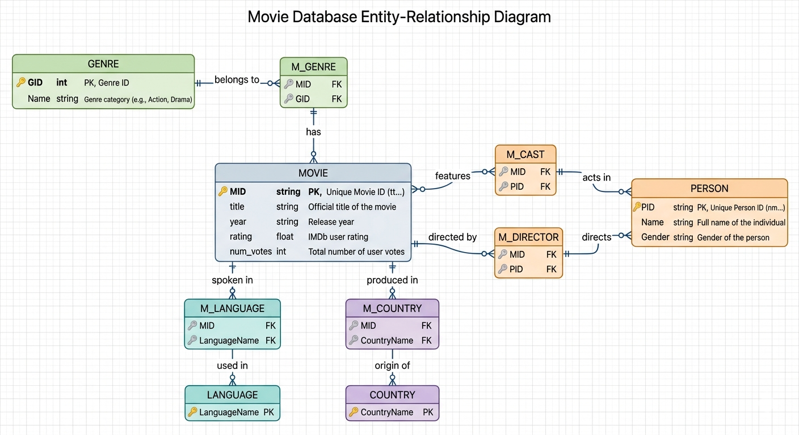

 **Session 2 Homework: The IMDb SQL Challenge**

---
### 🗺️ Entity Relationship Diagram (ERD)

Below is the visual map of how the tables connect. Most relationships are **Many-to-Many**, managed through "Bridge" tables (prefixed with `M_`).



### 🔍 Database Schema Map (Quick Reference)
Before writing the queries, here is how the tables in your database are mapped:
- **`Movie`** (`MID`, `title`, `year`, `rating`, `num_votes`)
- **`Person`** (`PID`, `Name`, `Gender`)
- **`Genre`** (`GID`, `Name`) & **`M_Genre`** (`MID`, `GID`)
- **`Language`** (`LAID`, `Name`) & **`M_Language`** (`MID`, `LAID`)
- **`Country`** (`CID`, `Name`) & **`M_Country`** (`MID`, `CID`)
- **`Location`** (`LID`, `Name`) & **`M_Location`** (`MID`, `LID`)
- **`M_Director`** (`MID`, `PID`) & **`M_Cast`** (`MID`, `PID`)

> [!TIP]
> **Data Quality Note:** Person and Genre names in this database sometimes contain leading or trailing whitespaces (e.g., `' Andy Serkis'` or `'Drama            '`). The queries below use the `TRIM()` function to clean up the output automatically.

---

### 📝 Solution Set

#### **1. `INNER JOIN`**
**Problem Statement:** List all movie **Titles** along with their **Primary Language** name.
```sql
SELECT m.title AS Movie_Title, 
       l.Name AS Primary_Language
FROM Movie m
INNER JOIN M_Language ml ON m.MID = ml.MID
INNER JOIN Language l ON ml.LAID = l.LAID;
```
* **How it works:** This query joins the `Movie` table to the bridge table `M_Language` on movie ID (`MID`), and then to the `Language` table on language ID (`LAID`).

---

#### **2. `LEFT JOIN`**
**Problem Statement:** List all **Person Names** and the **Titles** of movies they directed. Ensure that people who haven't directed any movies are still included in the list.
```sql
SELECT TRIM(p.Name) AS Person_Name, 
       m.title AS Movie_Title
FROM Person p
LEFT JOIN M_Director md ON p.PID = md.PID
LEFT JOIN Movie m ON md.MID = m.MID;
```
* **How it works:** By starting with the `Person` table and performing a `LEFT JOIN` on `M_Director` and `Movie`, we keep all individuals in the final result. If a person hasn't directed any movies, `Movie_Title` will return `NULL`.

---

#### **3. Multiple Tables**
**Problem Statement:** Display the **Movie Title**, its **Director's Name**, and its **Primary Genre** in a single result set.
```sql
SELECT m.title AS Movie_Title,
       TRIM(p.Name) AS Director_Name,
       TRIM(g.Name) AS Primary_Genre
FROM Movie m
INNER JOIN M_Director md ON m.MID = md.MID
INNER JOIN Person p ON md.PID = p.PID
INNER JOIN M_Genre mg ON m.MID = mg.MID
INNER JOIN Genre g ON mg.GID = g.GID;
```
* **How it works:** We perform a multi-table `INNER JOIN` linking `Movie` to its director via `M_Director` ↔ `Person`, and to its genre via `M_Genre` ↔ `Genre`.

---

#### **4. Group By + Join**
**Problem Statement:** Which **Country** has the highest average movie rating? List the top 5 countries.
```sql
SELECT c.Name AS Country_Name, 
       ROUND(AVG(m.rating), 2) AS Average_Rating
FROM Country c
INNER JOIN M_Country mc ON c.CID = mc.CID
INNER JOIN Movie m ON mc.MID = m.MID
GROUP BY c.Name
ORDER BY Average_Rating DESC
LIMIT 5;
```
* **How it works:** This query aggregates the rating data of movies grouped by their country of origin (`c.Name`), calculates the average rating, and returns the top 5 in descending order.

---

#### **5. Subquery (`WHERE`)**
**Problem Statement:** Find all movies that were released in the same **Year** as the movie titled `'Mowgli'`.
```sql
SELECT title, 
       year
FROM Movie
WHERE year = (
    SELECT year 
    FROM Movie 
    WHERE title = 'Mowgli'
);
```
* **How it works:** The subquery finds the release year of the movie `'Mowgli'` (which is `2018`), and the outer query filters all movies from the `Movie` table matching that year.

---

#### **6. Subquery (`IN`)**
**Problem Statement:** List the names of all **Actors** who have worked in at least one movie belonging to the `'Drama'` genre.
```sql
SELECT DISTINCT TRIM(Name) AS Actor_Name
FROM Person
WHERE PID IN (
    SELECT PID
    FROM M_Cast
    WHERE MID IN (
        SELECT MID
        FROM M_Genre mg
        INNER JOIN Genre g ON mg.GID = g.GID
        WHERE g.Name LIKE '%Drama%'
    )
);
```
* **How it works:** The innermost query finds all movie IDs (`MID`) categorized under genres containing `'Drama'` (using `LIKE '%Drama%'` because genres are stored as comma-separated values). The middle query finds the `PID`s of actors in those movies. The outer query matches those IDs with names in the `Person` table.

---

#### **7. `CTE`**
**Problem Statement:** Create a CTE to find the average rating of all `'Action'` movies. Then, list all Action movies that have a rating **higher** than that average.
```sql
WITH ActionAvgRating AS (
    SELECT AVG(m.rating) AS avg_rating
    FROM Movie m
    INNER JOIN M_Genre mg ON m.MID = mg.MID
    INNER JOIN Genre g ON mg.GID = g.GID
    WHERE g.Name LIKE '%Action%'
)
SELECT m.title AS Movie_Title, 
       m.rating AS Rating,
       ROUND(ActionAvgRating.avg_rating, 2) AS Average_Action_Rating
FROM Movie m
INNER JOIN M_Genre mg ON m.MID = mg.MID
INNER JOIN Genre g ON mg.GID = g.GID
CROSS JOIN ActionAvgRating
WHERE g.Name LIKE '%Action%' 
  AND m.rating > ActionAvgRating.avg_rating
ORDER BY m.rating DESC;
```
* **How it works:** The CTE `ActionAvgRating` computes the average rating of all Action movies. The main query uses a `CROSS JOIN` to reference this average and filters for Action movies with a rating strictly above this benchmark.

---

#### **8. Business Logic**
**Problem Statement:** Find the top 3 **Directors** who have the highest total number of **Votes** across all their movies combined.
```sql
SELECT TRIM(p.Name) AS Director_Name, 
       SUM(m.num_votes) AS Total_Votes
FROM Person p
INNER JOIN M_Director md ON p.PID = md.PID
INNER JOIN Movie m ON md.MID = m.MID
GROUP BY p.PID, p.Name
ORDER BY Total_Votes DESC
LIMIT 3;
```
* **How it works:** We link directors to their movies, sum the `num_votes` field per director, and output the top 3 (e.g., Joss Whedon, Danny Boyle, and Rajkumar Hirani).

---

#### **9. Multiple Joins**
**Problem Statement:** List the names of **Actors** who have worked in movies filmed in the `'USA'`. (Hint: You'll need to join 4 tables).

Depending on how "filmed in" is interpreted, we can look at either the country of production or the filming location:

**Option A (Using the `Country` table):**
```sql
SELECT DISTINCT TRIM(p.Name) AS Actor_Name
FROM Person p
INNER JOIN M_Cast mc ON p.PID = mc.PID
INNER JOIN M_Country mc2 ON mc.MID = mc2.MID
INNER JOIN Country c ON mc2.CID = c.CID
WHERE c.Name = 'USA';
```

**Option B (Using the specific `Location` table):**
```sql
SELECT DISTINCT TRIM(p.Name) AS Actor_Name
FROM Person p
INNER JOIN M_Cast mc ON p.PID = mc.PID
INNER JOIN M_Location ml ON mc.MID = ml.MID
INNER JOIN Location l ON ml.LID = l.LID
WHERE l.Name LIKE '%USA%';
```
* **How it works:** Both options successfully join 4 tables (`Person` ↔ `M_Cast` ↔ `M_Country`/`M_Location` ↔ `Country`/`Location`) to find the actors who worked in USA-based films.

---

#### **10. CTE + Ranking**
**Problem Statement:** For each **Language**, find the movie with the highest rating. (Use a CTE to organize your work).
```sql
WITH RankedMovies AS (
    SELECT l.Name AS Language_Name,
           m.title AS Movie_Title,
           m.rating AS Rating,
           ROW_NUMBER() OVER(PARTITION BY l.Name ORDER BY m.rating DESC) as rn
    FROM Movie m
    INNER JOIN M_Language ml ON m.MID = ml.MID
    INNER JOIN Language l ON ml.LAID = l.LAID
)
SELECT Language_Name, 
       Movie_Title, 
       Rating
FROM RankedMovies
WHERE rn = 1
ORDER BY Language_Name;
```
* **How it works:** The CTE joins movies and languages and computes a rank (`rn`) using the window function `ROW_NUMBER()`. It partitions the ranking by language and orders by rating descending. The outer query filters for `rn = 1` to get the top movie for each language.

---

#### **11. Subquery**
**Problem Statement:** Find the names of **People** who have acted in more movies than the average number of movies per actor.
```sql
SELECT TRIM(p.Name) AS Actor_Name, 
       COUNT(mc.MID) AS Movie_Count
FROM Person p
INNER JOIN M_Cast mc ON p.PID = mc.PID
GROUP BY p.PID, p.Name
HAVING Movie_Count > (
    SELECT AVG(cnt)
    FROM (
        SELECT COUNT(MID) as cnt
        FROM M_Cast
        GROUP BY PID
    )
);
```
* **How it works:** The subquery finds the average number of movie appearances per actor in the database (which is approximately `2.58`). The outer query aggregates the cast lists and uses `HAVING` to filter out actors who have acted in more than this average count.

---

#### **12. Advanced Join**
**Problem Statement:** Find "Duo" pairs: List **Directors** and **Actors** who have worked together on more than 3 different movies.
```sql
SELECT TRIM(p_dir.Name) AS Director_Name,
       TRIM(p_act.Name) AS Actor_Name,
       COUNT(DISTINCT md.MID) AS Movies_Together
FROM M_Director md
INNER JOIN M_Cast mc ON md.MID = mc.MID
INNER JOIN Person p_dir ON md.PID = p_dir.PID
INNER JOIN Person p_act ON mc.PID = p_act.PID
WHERE md.PID <> mc.PID -- Excludes cases where the director acts in their own movie
GROUP BY md.PID, mc.PID, p_dir.Name, p_act.Name
HAVING Movies_Together > 3
ORDER BY Movies_Together DESC;
```
* **How it works:** By joining `M_Director` and `M_Cast` on `MID`, we pair up the directors and actors of every movie. We join the `Person` table twice (using aliases `p_dir` and `p_act`) to fetch the respective names, filter out self-direction, group by the pair, and use `HAVING` to find duos with more than 3 collaborations.

---

## 🏆 The Ultimate Interview Prep Set: 10 Mixed SQL Challenges

Ready for the real deal? These questions are mixed up—just like in a real interview. You'll need to decide whether to use a **Join, Subquery, CTE, or Group By** on your own. 🧠

---

### ⚡ The "No-Topic" Challenge Solutions

#### **1. Director Average Ratings**
**Problem Statement:** Find the average rating of movies for each **Director**, but only include directors who have directed **more than 2 movies**. (Difficulty: ⭐⭐)
```sql
SELECT TRIM(p.Name) AS Director_Name,
       ROUND(AVG(m.rating), 2) AS Avg_Rating,
       COUNT(md.MID) AS Movies_Directed
FROM Person p
INNER JOIN M_Director md ON p.PID = md.PID
INNER JOIN Movie m ON md.MID = m.MID
GROUP BY p.PID, p.Name
HAVING Movies_Directed > 2
ORDER BY Avg_Rating DESC;
```
* **How it works:** We join `Person`, `M_Director`, and `Movie`. We group by the director's unique ID and name, count their directed movies, and use the `HAVING` clause to filter for those with `Movies_Directed > 2`. Finally, we order by their average rating in descending order.

---

#### **2. Action & Adventure Double-Genre**
**Problem Statement:** List all **Movie Titles** that are classified under *both* the **'Action'** and **'Adventure'** genres. (Difficulty: ⭐⭐⭐)
```sql
SELECT m.title AS Movie_Title, 
       TRIM(g.Name) AS Genre_List
FROM Movie m
INNER JOIN M_Genre mg ON m.MID = mg.MID
INNER JOIN Genre g ON mg.GID = g.GID
WHERE g.Name LIKE '%Action%' 
  AND g.Name LIKE '%Adventure%';
```
* **How it works:** Because genres in this database are denormalized and stored as a combined string (e.g. `'Action, Adventure, Fantasy'`), a movie belongs to both if its genre name matches both `'Action'` and `'Adventure'`. If the database were fully normalized, you would instead group by the movie and use `HAVING COUNT(DISTINCT g.Name) = 2`.

---

#### **3. Prolific Actor Post-2015**
**Problem Statement:** Find the name of the **Actor** who has appeared in the highest number of movies released **after the year 2015**. (Difficulty: ⭐⭐)
```sql
SELECT TRIM(p.Name) AS Actor_Name,
       COUNT(mc.MID) AS Movie_Count
FROM Person p
INNER JOIN M_Cast mc ON p.PID = mc.PID
INNER JOIN Movie m ON mc.MID = m.MID
WHERE CAST(m.year AS INTEGER) > 2015
GROUP BY p.PID, p.Name
ORDER BY Movie_Count DESC
LIMIT 1;
```
* **How it works:** We filter the movies released after `2015` using `CAST(m.year AS INTEGER) > 2015`, group the cast appearances by actor, order by the count of movies descending, and use `LIMIT 1` to get the top actor.

---

#### **4. Underperforming Languages**
**Problem Statement:** Identify **Languages** that do not have a single movie with a rating above **8.0**. (Difficulty: ⭐⭐⭐)

**Using Subquery (NOT IN):**
```sql
SELECT Name AS Language_Name
FROM Language
WHERE LAID NOT IN (
    SELECT DISTINCT ml.LAID
    FROM M_Language ml
    INNER JOIN Movie m ON ml.MID = m.MID
    WHERE m.rating > 8.0
);
```

**Using Group By & Having:**
```sql
SELECT l.Name AS Language_Name, 
       MAX(m.rating) AS Max_Rating
FROM Language l
INNER JOIN M_Language ml ON l.LAID = ml.LAID
INNER JOIN Movie m ON ml.MID = m.MID
GROUP BY l.LAID, l.Name
HAVING MAX(m.rating) <= 8.0;
```
* **How it works:** 
  - The **Subquery** approach selects all languages whose IDs are not in the list of languages associated with movies rated above `8.0`. This is robust as it also captures languages with no movie entries.
  - The **Group By** approach aggregates the ratings by language and keeps only those whose maximum movie rating is less than or equal to `8.0`.

---

#### **5. Cast Size Comparison**
**Problem Statement:** Find all movies that have a **Cast size** (number of actors) larger than the movie **'Ocean\'s Eight'**. (Difficulty: ⭐⭐⭐)
```sql
SELECT m.title AS Movie_Title, 
       COUNT(mc.PID) AS Cast_Size
FROM Movie m
INNER JOIN M_Cast mc ON m.MID = mc.MID
GROUP BY m.MID, m.title
HAVING Cast_Size > (
    SELECT COUNT(mc2.PID)
    FROM M_Cast mc2
    INNER JOIN Movie m2 ON mc2.MID = m2.MID
    WHERE m2.title = 'Ocean''s Eight'
)
ORDER BY Cast_Size DESC;
```
* **How it works:** The subquery finds the cast size for `'Ocean''s Eight'` (which is `238`). The outer query aggregates the cast size for all other movies in the database and filters for those with a cast size greater than `238`. 
* *Note: In this database, "Ocean's Eight" actually has the largest cast size (238), so this query will return 0 rows.*

---

#### **6. Most International Genre**
**Problem Statement:** Which **Genre** is the most "International"? (The one with the highest number of **distinct languages**). (Difficulty: ⭐⭐⭐)
```sql
SELECT TRIM(g.Name) AS Genre_Name,
       COUNT(DISTINCT ml.LAID) AS Distinct_Languages_Count
FROM Genre g
INNER JOIN M_Genre mg ON g.GID = mg.GID
INNER JOIN M_Language ml ON mg.MID = ml.MID
GROUP BY g.GID, g.Name
ORDER BY Distinct_Languages_Count DESC
LIMIT 1;
```
* **How it works:** We join `Genre`, `M_Genre`, and `M_Language` to get language details for each genre. We group by genre and count the number of distinct language IDs (`LAID`) associated with it. Sorting in descending order and limiting to 1 returns the top genre.

---

#### **7. Top Director Per Year by Votes**
**Problem Statement:** For **each Year**, find the **Director** whose movies received the highest **Total Votes** in that specific year. (Difficulty: ⭐⭐⭐⭐)
```sql
WITH DirectorVotesPerYear AS (
    SELECT m.year AS Movie_Year,
           p.PID AS Director_PID,
           TRIM(p.Name) AS Director_Name,
           SUM(m.num_votes) AS Total_Votes,
           ROW_NUMBER() OVER(PARTITION BY m.year ORDER BY SUM(m.num_votes) DESC) as rn
    FROM Movie m
    INNER JOIN M_Director md ON m.MID = md.MID
    INNER JOIN Person p ON md.PID = p.PID
    GROUP BY m.year, p.PID, p.Name
)
SELECT Movie_Year, Director_Name, Total_Votes
FROM DirectorVotesPerYear
WHERE rn = 1
ORDER BY Movie_Year DESC;
```
* **How it works:** We use a CTE to sum the votes for each director grouped by year. We use the window function `ROW_NUMBER() OVER (PARTITION BY m.year ORDER BY SUM(m.num_votes) DESC)` to rank directors within each year. The outer query filters for the top director (`rn = 1`) for each year.

---

#### **8. Actors Who Never Directed**
**Problem Statement:** List all people who have **Acted** in at least one movie but have **never Directed** a movie in this dataset. (Difficulty: ⭐⭐)
```sql
SELECT DISTINCT TRIM(p.Name) AS Person_Name
FROM Person p
INNER JOIN M_Cast mc ON p.PID = mc.PID
WHERE p.PID NOT IN (
    SELECT DISTINCT md.PID
    FROM M_Director md
);
```
* **How it works:** We select all unique people who exist in the `M_Cast` table (meaning they have acted) and filter out any person whose `PID` is in the list of directors from `M_Director`.

---

#### **9. Percentage of USA Movies**
**Problem Statement:** Find the **Percentage** of movies in the entire database that are produced in the **'USA'**. (Difficulty: ⭐⭐⭐)
```sql
SELECT 
    ROUND(
        (SELECT COUNT(DISTINCT MID) FROM M_Country mc INNER JOIN Country c ON mc.CID = c.CID WHERE c.Name = 'USA') * 100.0 / 
        (SELECT COUNT(*) FROM Movie), 
        2
    ) AS USA_Movie_Percentage;
```
* **How it works:** We calculate the count of distinct movies whose country is `'USA'` (using subquery joins), multiply by `100.0` to force real-number division, divide by the total movie count, and round to `2` decimal places.

---

#### **10. Double Threats (Actor-Directors)**
**Problem Statement:** Find "Double Threats": List movies where the **Director** is also part of the **Cast** for that same movie. (Difficulty: ⭐⭐⭐⭐)
```sql
SELECT m.title AS Movie_Title,
       TRIM(p.Name) AS Director_Actor_Name
FROM M_Director md
INNER JOIN M_Cast mc ON md.MID = mc.MID AND md.PID = mc.PID
INNER JOIN Movie m ON md.MID = m.MID
INNER JOIN Person p ON md.PID = p.PID;
```
* **How it works:** We join the `M_Director` and `M_Cast` tables matching on both `MID` (same movie) and `PID` (same person). We then join with the `Movie` and `Person` tables to fetch the titles and names.


